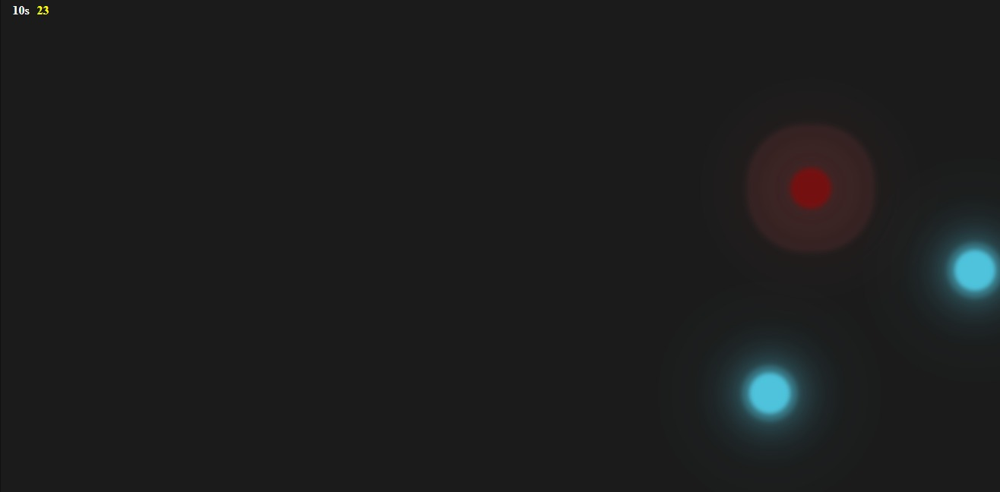
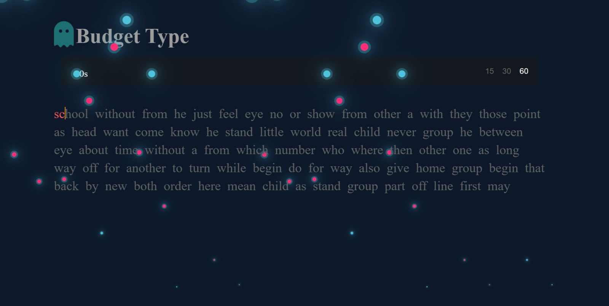
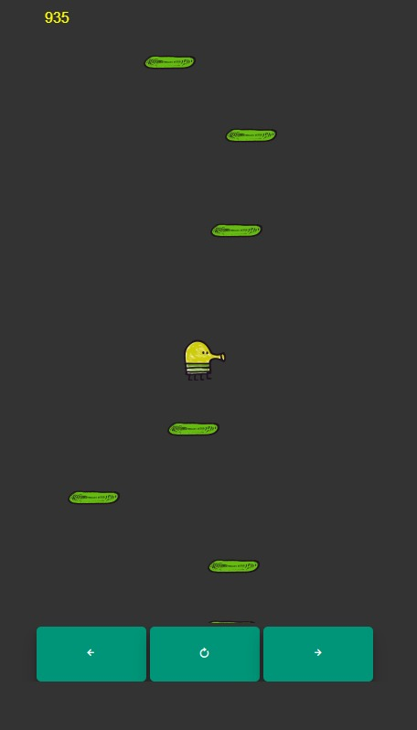
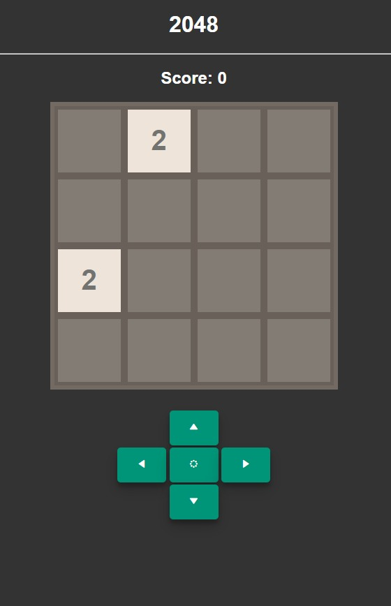

# My Random Website

This is my test website where I do random works and stuff. 

## Showcase

### Game Section
- **Flappy Bird**: A classic arcade game where you control a bird and try to avoid pipes.
- **Budget Type**: A game to test and improve your typing speed and accuracy.
- **Sudoku Cheat**: An interactive Sudoku solver that can help you solve puzzles.
- **Doodle Jump**: A fun jumping game where you control a character to avoid obstacles and collect points.
- **Aim Training**: A game designed to improve your aim by clicking circles on the screen.
- **2048**: A number puzzle game where you combine tiles to reach 2048 or asmuch as you can go.

### Gallery Section
- A collection of my **artworks**, ranging from digital art to traditional pieces. This section provides a visual display of my creative projects.

## Tech Stack
- **Frontend**: HTML, CSS, JavaScript

## Accesss
1. Visit [https://a56-a5.github.io/Random-Stuff/](https://a56-a5.github.io/Random-Stuff/)

## Contributing
Feel free to fork this project or make improvements.

